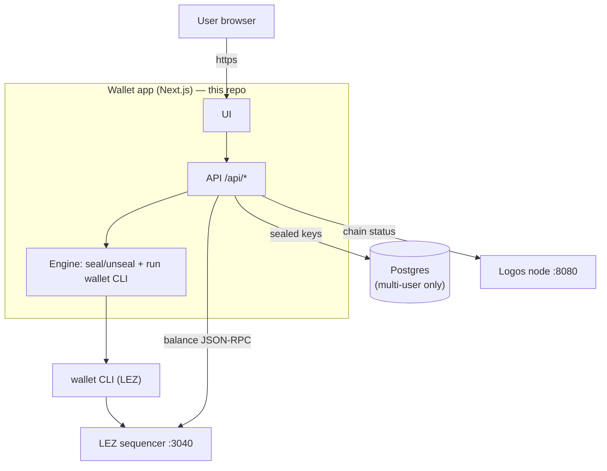
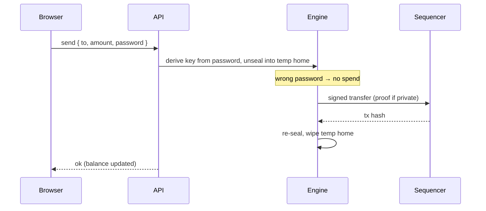
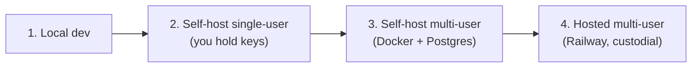

# Logos Wallet

A web wallet for the **Logos Execution Zone (LEZ)** native token: create an
account, check balances, receive (QR), and send — including **private transfers
whose ZK proof is generated server-side**. Runs as a personal single-user wallet
or as a hosted **multi-user custodial** wallet where each user's key is locked
with their password.

> UI → **http://localhost:3344**

> **Disclaimer:** Independent, community-built. Not affiliated with or endorsed by
> the Logos / Nomos core team. Provided as-is. Custodial mode means *you hold
> users' funds* — read [docs/SECURITY.md](docs/SECURITY.md) first.

---

## What it is



The browser never touches keys or the prover. The chain (node + sequencer) is
**external and pluggable** — point it at your own or an existing one. Full detail
in [docs/ARCHITECTURE.md](docs/ARCHITECTURE.md).

## How it works (send, in short)



Verified end-to-end on-chain: faucet → balance 150 → send 40 → balances 110 / 40.

---

## Quickstart (local)

```bash
cp .env.example .env.local     # set NODE_API / SEQUENCER_API (+ multi-user vars)
npm install
npm run dev                    # → http://localhost:3344
```

Read features (balance, chain status) work with just a reachable node + sequencer.
Write features (create / send / faucet) need the `wallet` CLI installed and a
sequencer whose commit **matches** your wallet build (see below).

## Deployment options



| Type | Keys held by | Needs | Guide |
|---|---|---|---|
| Local dev | you | local chain + CLI | this page |
| Self-host single-user | you | Docker | [DEPLOYMENT](docs/DEPLOYMENT.md) |
| Self-host multi-user | server (password-sealed) | Docker + Postgres | [DEPLOYMENT](docs/DEPLOYMENT.md) |
| Hosted multi-user | server (password-sealed) | Railway + secrets | [RAILWAY-DEPLOY](docs/RAILWAY-DEPLOY.md) |

```bash
# self-host single-user
docker compose up -d --build
# self-host multi-user
SESSION_SECRET=... WALLET_PEPPER=... docker compose -f docker-compose.multiuser.yml up -d --build
```

## Connecting to a node / sequencer

The app holds no chain — set two env vars:

```
NODE_API=http://localhost:8080        # Logos node — chain status
SEQUENCER_API=http://localhost:3040   # LEZ sequencer — tx + balances
```

You can use **your own**, an **existing/third-party** one, or a **mix** (e.g. your
sequencer + someone's node). To let others connect to *yours*, put it behind TLS
and publish the URLs **plus the lez commit** your sequencer runs. Full guide:
[docs/NODE-AND-SEQUENCER.md](docs/NODE-AND-SEQUENCER.md).

> ⚠️ **Version match:** the `wallet` CLI must be built from the **same commit** as
> the sequencer, or transfers fail with `InvalidSignature`. Tested-good pair: lez
> commit **`cf3639d8`** (env var `NSSA_WALLET_HOME_DIR`).

## Configuration

| Var | Meaning |
|---|---|
| `NODE_API` | Logos node URL (reads) |
| `SEQUENCER_API` | LEZ sequencer URL (tx + balance) |
| `WALLET_BIN` | path to the `wallet` binary |
| `PROOF_TIMEOUT_SECONDS` | max wait for a proof (default 600) |
| `DATABASE_URL` | Postgres (multi-user) |
| `SESSION_SECRET` | session cookie key, ≥32 chars (multi-user) |
| `WALLET_PEPPER` | KDF pepper, ≥32 chars, **never change after launch** (multi-user) |
| `WALLET_HOMES_DIR` | where per-user temp homes are materialized |
| `PROOF_CONCURRENCY` | max simultaneous proofs (default 2) |

Full template: [`.env.example`](.env.example).

## Security at a glance

- Passwords: **Argon2id**; keys at rest: **AES-256-GCM** sealed under a password-
  derived KEK + server pepper. DB holds **ciphertext only**.
- Send requires the password **every time** (key never cached). Wrong password →
  **no spend**. Recovery phrase shown **once**, never stored.
- Rate limits, security headers, audit log, proving concurrency cap.

Details + threat model: [docs/SECURITY.md](docs/SECURITY.md).

---

## Documentation

Everything lives in [`docs/`](docs/README.md):

| Doc | What |
|---|---|
| [ARCHITECTURE](docs/ARCHITECTURE.md) | components + request flows (diagrams) |
| [DEPLOYMENT](docs/DEPLOYMENT.md) | the 4 deployment types + parts |
| [NODE-AND-SEQUENCER](docs/NODE-AND-SEQUENCER.md) | own vs existing chain; hosting yours |
| [RAILWAY-DEPLOY](docs/RAILWAY-DEPLOY.md) | hosted multi-user, step by step |
| [SECURITY](docs/SECURITY.md) | threat model + findings |
| [PRD](docs/PRD.md) · [SPEC](docs/SPEC.md) | product + technical contract |
| [PHASE-RESULTS](docs/PHASE-RESULTS.md) | build + verification log |
| [CODE-QUALITY](docs/CODE-QUALITY.md) | gates + conventions |
| [RESEARCH-C-browser-proving](docs/RESEARCH-C-browser-proving.md) | in-browser proving verdict |
| [PLAN-multi-user-wallet](docs/PLAN-multi-user-wallet.md) | plain-language plan |

## Project scripts

```bash
npm run dev         # dev server (localhost:3344)
npm run build       # production build
npm run start       # run production build
npm run lint        # eslint
npm run typecheck   # tsc --noEmit
npm run test:vault  # crypto vault unit tests
```
