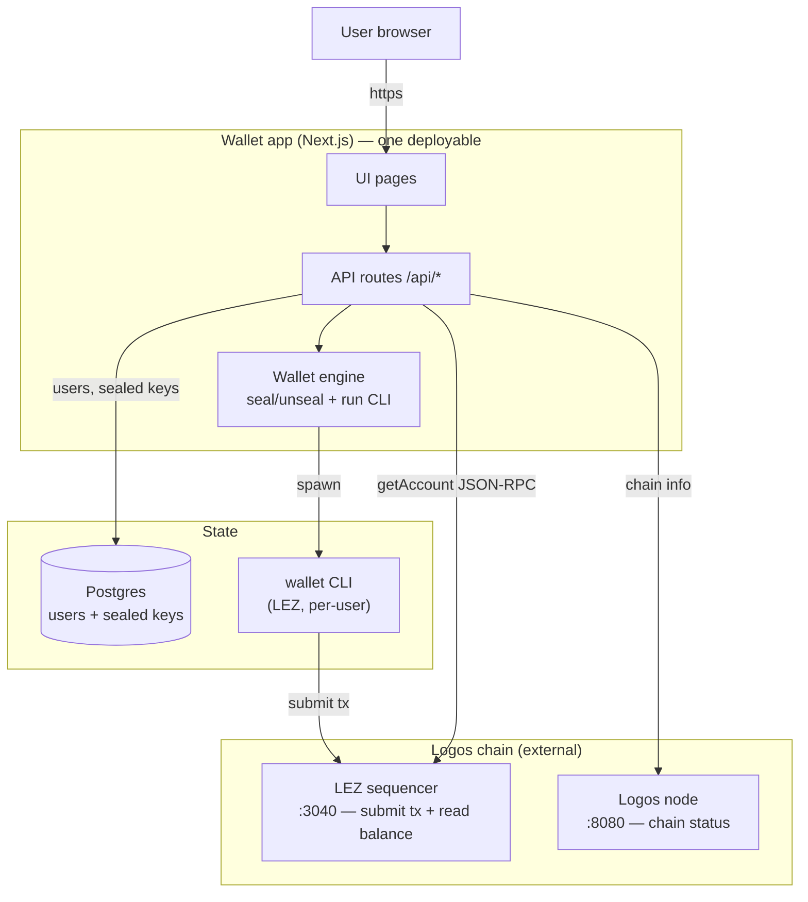
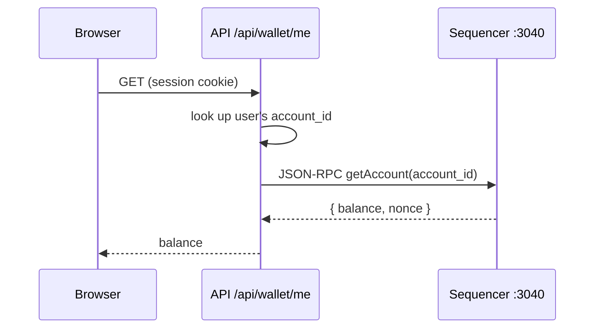
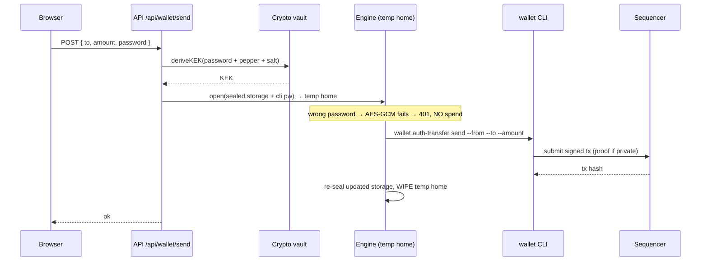
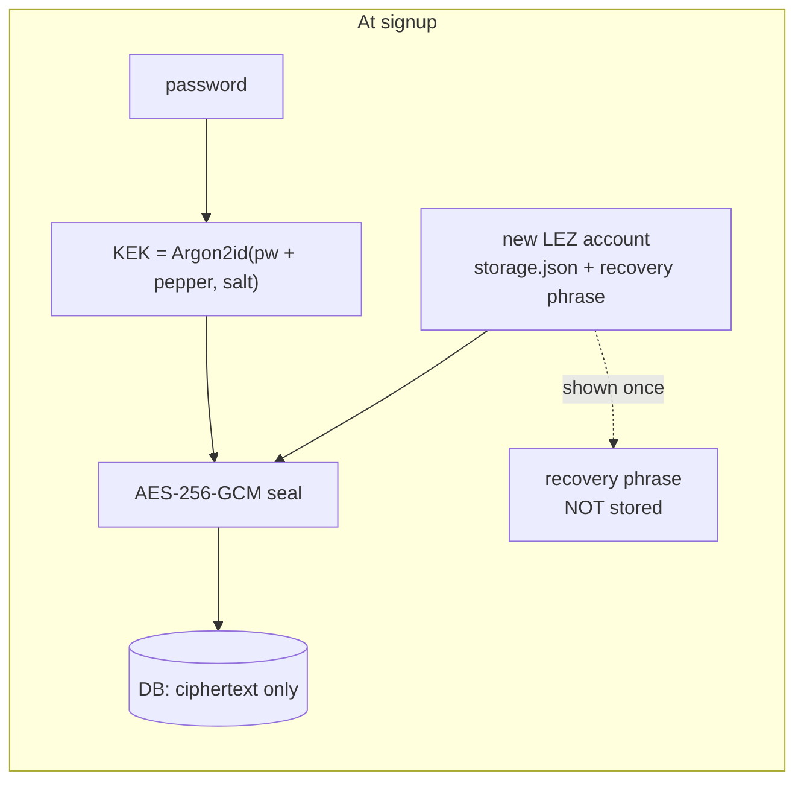

# Architecture

How the wallet is put together and how a request flows through it.

← back to [README](../README.md) · related: [SECURITY](SECURITY.md) · [DEPLOYMENT](DEPLOYMENT.md) · [NODE-AND-SEQUENCER](NODE-AND-SEQUENCER.md)

## What it is

A web wallet for the **Logos Execution Zone (LEZ)** native token. Users create an
account, check balances, receive, and send (public or private). It runs in two
shapes:

- **Single-user** — a personal UI over a local wallet (you hold your own keys).
- **Multi-user custodial** — a hosted site where many users sign up; the server
  holds each user's key **sealed with their password**.

## System overview

**Key point:** the browser never touches keys or the prover. Everything sensitive
happens server-side; the chain (node + sequencer) is external and pluggable
(see [NODE-AND-SEQUENCER](NODE-AND-SEQUENCER.md)).

## Components

| Part | Role |
|---|---|
| **UI pages** | Login, dashboard, send/receive |
| **API routes** (`src/app/api/*`) | Auth, wallet read/write; the trust boundary (validation, rate limits) |
| **Wallet engine** (`src/lib/wallet-engine.ts`) | Derives the KEK, unseals the key into a temp home, runs the CLI, re-seals, wipes |
| **Crypto vault** (`src/lib/crypto-vault.ts`) | Argon2id KEK + AES-256-GCM seal/open |
| **Postgres** | `users` (Argon2id login hash), `wallets` (sealed key + storage), `audit_log` |
| **wallet CLI** | The real LEZ wallet — key gen, signing, proof generation |
| **Sequencer** | LEZ execution layer: accepts transactions, answers balance queries |
| **Node** | Logos blockchain node: chain height / status |

## How a read works (balance — no password)

## How a send works (password required every time)

## How the key stays safe

At rest the DB holds **only** ciphertext + the public `account_id`/`pk`. No
plaintext key, no password, no recovery phrase. Details in [SECURITY](SECURITY.md).
