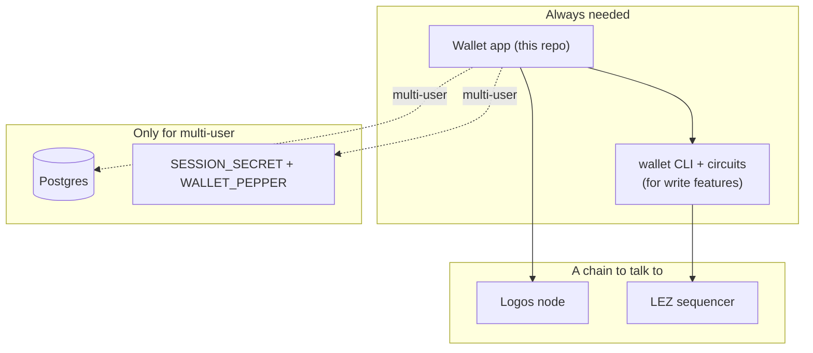
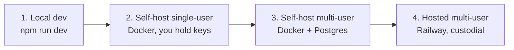
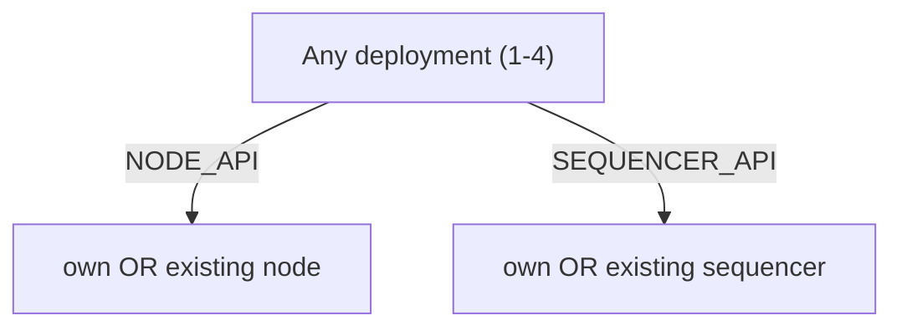

# Deployment

The deployment types, their parts, and how to pick one.

← back to [README](../README.md) · related: [NODE-AND-SEQUENCER](NODE-AND-SEQUENCER.md) · [RAILWAY-DEPLOY](RAILWAY-DEPLOY.md) · [SECURITY](SECURITY.md)

## Parts of any deployment



- **App** — always. Read-only features work with just `NODE_API` + `SEQUENCER_API`.
- **wallet CLI + circuits** — needed for create/transfer/faucet (and proofs).
- **node + sequencer** — your own or existing ([NODE-AND-SEQUENCER](NODE-AND-SEQUENCER.md)).
- **Postgres + secrets** — only in multi-user custodial mode.

## The four deployment types



| # | Type | Who holds keys | Needs | Guide |
|---|---|---|---|---|
| 1 | **Local dev** | you | node+seq+CLI local | [README quickstart](../README.md) |
| 2 | **Self-host single-user** | you | Docker; own/existing chain | below + [README](../README.md) |
| 3 | **Self-host multi-user** | server (sealed by password) | Docker + Postgres | below |
| 4 | **Hosted multi-user** | server (sealed by password) | Railway + Postgres + secrets | [RAILWAY-DEPLOY](RAILWAY-DEPLOY.md) |

### 1. Local dev
```bash
cp .env.example .env.local   # point NODE_API / SEQUENCER_API at your chain
npm install && npm run dev    # → http://localhost:3344
```

### 2. Self-host single-user (Docker)
```bash
docker compose up -d --build  # UI at http://localhost:3344
```
UI-only image; mount a Linux `wallet` binary + circuits for write features (see
the commented volumes in `docker-compose.yml`). You hold your own keys.

### 3. Self-host multi-user (Docker + Postgres)
```bash
SESSION_SECRET=... WALLET_PEPPER=... \
  docker compose -f docker-compose.multiuser.yml up -d --build
```
Adds Postgres. Many users sign up; the server custodies each key sealed by the
user's password. The image must contain the `wallet` CLI + circuits.

### 4. Hosted multi-user on Railway
Full custodial product. See **[RAILWAY-DEPLOY](RAILWAY-DEPLOY.md)** — Postgres
add-on, secrets (`SESSION_SECRET`, `WALLET_PEPPER`), node/sequencer wiring, and
baking the `wallet` CLI into the image (pin commit `cf3639d8`).

## Chain wiring is independent of deployment type

Any of the four can use **your own** node/sequencer or an **existing** one — just
set `NODE_API` / `SEQUENCER_API`. See [NODE-AND-SEQUENCER](NODE-AND-SEQUENCER.md).



## Cannot use pure serverless

The `wallet` CLI is a persistent process with a key store + circuits, and proving
is heavy (minutes, ~2 GB RAM). Use a real container/VM (Railway, a VPS, Docker),
**not** serverless functions. See [RESEARCH-C-browser-proving](RESEARCH-C-browser-proving.md)
for why in-browser proving isn't a way around this yet.
