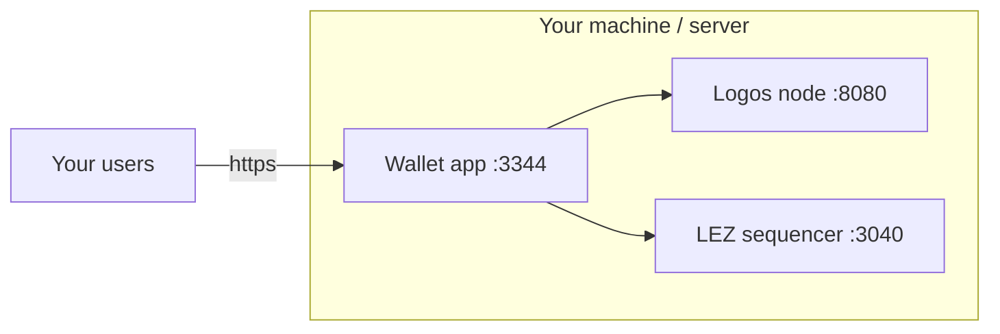
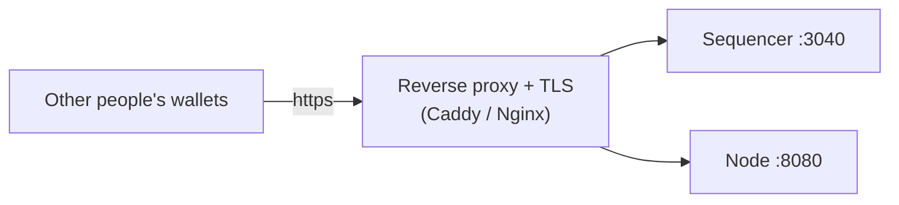

# Node & Sequencer — what to connect to

The wallet itself holds no chain. It talks to two external services, set by env:

| Env var | Service | Used for |
|---|---|---|
| `NODE_API` | Logos **node** (`:8080`) | chain status / health |
| `SEQUENCER_API` | LEZ **sequencer** (`:3040`) | submit transactions + read balances |

← back to [README](../README.md) · related: [ARCHITECTURE](ARCHITECTURE.md) · [DEPLOYMENT](DEPLOYMENT.md)

> ⚠️ **Version match matters.** The `wallet` CLI must be built from the **same
> commit** as the sequencer it talks to, or transactions fail with
> `InvalidSignature`. In testing the working pair was lez commit **`cf3639d8`**.

## The choice in one picture

```mermaid
flowchart TB
  app["Wallet app<br/>NODE_API + SEQUENCER_API"]

  subgraph own["Option A — run your own"]
    mynode["Your node :8080"]
    myseq["Your sequencer :3040"]
  end

  subgraph existing["Option B — use an existing one"]
    theirnode["Someone's node"]
    theirseq["Someone's sequencer"]
  end

  app -->|point env at| own
  app -. or .->|point env at| existing
```

You can mix: e.g. **your own sequencer** + **someone else's node** (the "mix"
setup). What matters is each URL is reachable from the app and the sequencer's
version matches your wallet CLI.

## Option A — run your own node + sequencer

Best for full control / production. You operate both services.



**Steps (local/standalone):**
```bash
# node: run a Logos blockchain node (exposes :8080)
# sequencer: from the lez checkout matching your wallet
cargo run --features standalone -p sequencer_runner sequencer_runner/configs/debug
# → sequencer on :3040
```
Then set in the wallet:
```
NODE_API=http://localhost:8080
SEQUENCER_API=http://localhost:3040
```

## Option B — connect to an existing node/sequencer

Best when someone already runs the infra (a team, a public provider, you on
another box). You only run the wallet app.

```
NODE_API=https://node.example.com
SEQUENCER_API=https://sequencer.example.com
```
**What you need from the operator:**
- the **node URL** and **sequencer URL** (reachable from where your app runs),
- the **lez commit** their sequencer runs (so you build a matching `wallet` CLI),
- whether the endpoints need auth / are rate-limited.

## Making YOUR node/sequencer available to others

So other people's wallets (or yours, remotely) can connect:



Checklist:
1. **Bind/forward the ports** — by default these listen locally; expose via a
   reverse proxy, not by opening the raw port.
2. **Put TLS in front** (Caddy/Nginx/Cloudflare) — give out `https://…` URLs.
3. **Publish two things:** the node URL, the sequencer URL, **and the lez commit**
   your sequencer runs (consumers must match it in their wallet build).
4. **Protect it** — the sequencer accepts transactions; add rate limiting / WAF.
   The `getAccount` read is harmless, but tx submission should be guarded.
5. **Keep versions stable** — if you upgrade the sequencer commit, consumers must
   rebuild their wallet CLI to match. Announce changes.

## Quick reference — who runs what

| Setup | You run | You point env at |
|---|---|---|
| All-local (dev) | node + sequencer + app | localhost |
| Self-host (own infra) | node + sequencer + app | your hosts |
| Use existing chain | app only | their node + sequencer |
| Mix | your sequencer + app | your sequencer + their node |
| Be a provider | node + sequencer (public) | — others point at you |

See [DEPLOYMENT](DEPLOYMENT.md) for how the app itself is deployed in each case.
