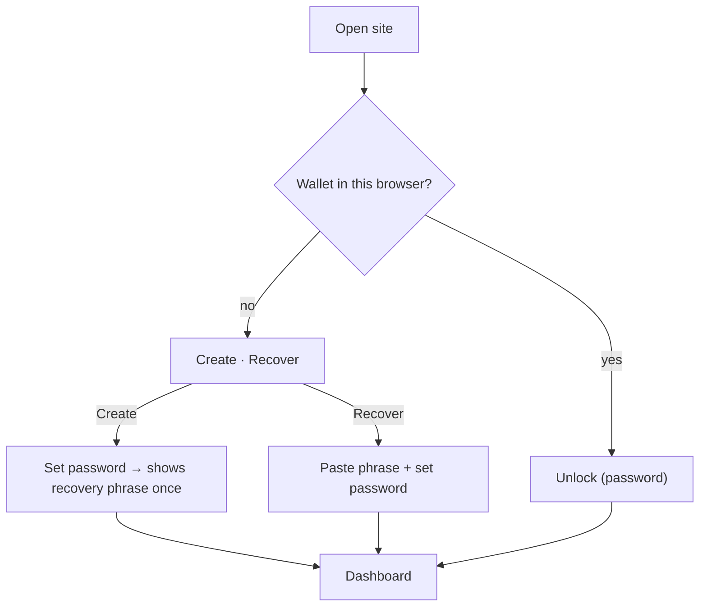
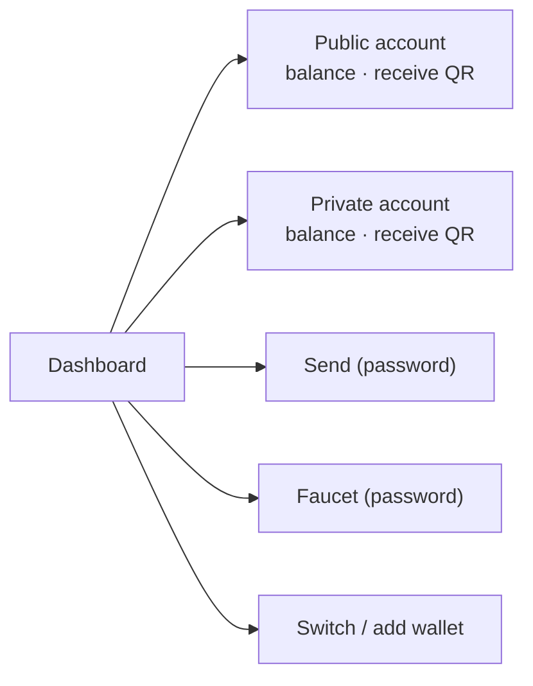
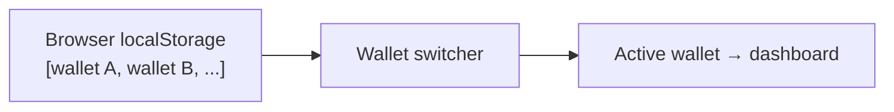

# UX Flow — MetaMask-style wallet (no email)

The agreed user model. This **replaces** the earlier email+password design.

← back to [README](../README.md) · related: [ARCHITECTURE](ARCHITECTURE.md) · [SECURITY](SECURITY.md)

## The model in one line

No email/login. A **wallet** lives in your browser; a **password** opens it,
encrypts the stored proof keys, and is required on every transaction. A
**recovery phrase** restores the wallet on a new device. Each wallet has **both**
a Public and a Private account.

## Entry screen

## The three entry actions

| Action | Asks for | Produces |
|---|---|---|
| **Create** | a password | a wallet = **Public + Private** account, both on-chain-initialized; **recovery phrase shown once** |
| **Recover** | recovery phrase + a new password | the same accounts regenerated from the phrase |
| **Unlock** | password | opens an existing wallet already in this browser |

## What the password does (MetaMask-style)

- **Encrypts** the stored proof-generation keys (server holds only ciphertext).
- **Opens** the wallet (verify before showing it).
- **Authorizes every transaction** (public or private) — never cached.

The recovery phrase is the only backup; lose password **and** phrase → funds gone.

## Dashboard

- See **both** accounts and their balances (read from the sequencer, no password).
- **Faucet** → fund an account (asks password).
- **Send** → choose from Public/Private, enter recipient + amount + **password**.
- **Switch / add wallet** → multiple wallets in this browser, pick the active one.

## Identity & storage

- Each wallet has a random **wallet id** (uuid). The browser's **localStorage**
  keeps the list of wallet ids on this device (this is the "wallet in this
  browser" check). Clearing it → use **Recover**.
- The server stores, per wallet id: the **sealed** storage.json (both accounts'
  keys) + sealed CLI password + the public/private account ids + KDF salt.
  **No email, no plaintext key, no recovery phrase.**

## Multiple wallets (requirement #5)

Create or recover more wallets; each is its own row + password. The switcher
changes which one the dashboard shows. Switching shows public info immediately;
a transaction on a wallet asks that wallet's password.

## API (new)

| Route | Body | Returns |
|---|---|---|
| `POST /api/wallet/create` | `{ password, label? }` | `{ walletId, publicAccountId, privateAccountId, recoveryPhrase }` (phrase once) |
| `POST /api/wallet/recover` | `{ phrase, password, label? }` | `{ walletId, publicAccountId, privateAccountId }` |
| `POST /api/wallet/unlock` | `{ walletId, password }` | `{ ok }` / 401 |
| `GET  /api/wallet/[id]/balance` | — | both accounts' balances (no password) |
| `POST /api/wallet/[id]/faucet` | `{ account: "public"\|"private", password }` | tx result |
| `POST /api/wallet/[id]/send` | `{ from, to, amount, password }` | tx result |

Replaces the email-based `/api/auth/*`.

## Verified behavior + known limits

Verified end-to-end via the API:
- **Create** → makes a Public + Private account, both initialized on-chain. The
  private init generates a ZK proof, so **create takes ~4-5 minutes** (the UI shows
  a "this can take a few minutes" state).
- **Unlock** → wrong password 401, right 200.
- **Balance** → both accounts, read from the sequencer (no password).
- **Faucet** (public) → balance 150. **Send** (public) → balance moves correctly.
- **Recover** → regenerates the wallet from the phrase.

**Known limit — private-account recovery:** recovery reproduces the **Public**
account id **exactly**, but the **Private** account id comes back **different**
because LEZ private accounts use a *random identifier* not derivable from the seed
(the underlying keys are from the same phrase, but the displayed id differs).
Public recovery is exact; treat private-account recovery as keys-restored-but-
id-may-differ until the chain's private-identifier semantics are confirmed.

**UX cost:** creating a wallet and any private send are slow (minutes) due to
proof generation. Public operations are fast (~12s).
